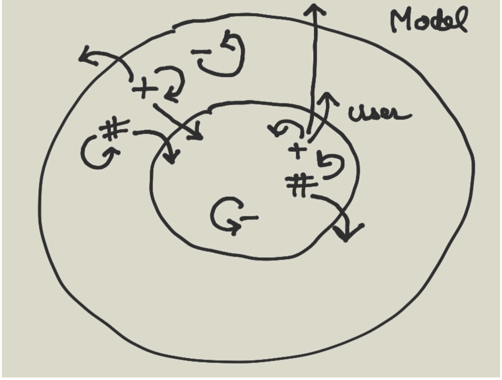

# Objet introduction

L'objet existe depuis la version 3 de PHP, à ce moment on n'a pas vraiment un langage de programmation objet.Ce n'est qu'à partir de la version 5 que PHP introduit les véritables concepts de l'objet.Bien que PHP soit un langage de script on va programmer tout en objet dans la suite de ce cours.

## Introduction à l'objet

### Définitions

- Def Classe 

Une classe est la somme des propriétés et attributs d'un objet. 
C'est une représentation abstraite d'un objet.

- Objet 

Un objet est une instance d'une classe.

- Def Attributs et méthodes d'une classe 

Les attributs d'une classe sont les variables d'une classe et les méthodes sont les fonctions de la classe. Plus généralement on appelle membre d'une classe les attributs ou méthodes d'une classe.
Exemples Ci-dessous une représentation abstraite d'un personnage, la classe "Persona" n'est pas, par définition, concrète. 
La classe représente l'implémentation des attributs (variables de la classe) et méthodes (fonctions de la classe), le code que l'on écrit dans la classe. 

Pour rendre "concrète" son utilisation, on fera une instance de la classe Persona.

```php

// d'abstrait la classe
class Persona{

    private $force ;
    private $secret = "my secret";

    // méthode magique elles commencent toutes par des __ 
    // constructeur permet d'initialiser nos variables
    public function __construct(
        $force, $secret
    ){
        $this->force = $force; // $this représente l'instance de la classe == object
        $this->secret = $secret;
    }

    // public == on peut accéder à la méthode de l'extérieur de la classe
    public function fight(){
        echo "missile";
    }

    // une méthode permettant d'accéder à la force de votre Persona
}

// concret 

// le constructeur si il a des paramètres ils seront à placer dans les parenthèses de la classe
$persona_01 = new Persona(10, 123);

print_r($persona_01);
print_r($persona_01->fight()); // méhode publique
echo PHP_EOL;


$persona_02 = new Persona(11, 321);

print_r($persona_02);
print_r($persona_02->fight());
echo PHP_EOL;

// version 8 on peut écrire les variables de la classe comme suit
class Persona{

    public function __construct(
        private $force, 
        private $secret = "my secret"
    ){}

    public function fight(){
        echo "missile";
    }
}
``` 

### Exercice

- Créez la méthode permettant d'afficher la variable force.
- Créez la méthode permettant d'afficher la variable secret. 


### Correction

```php


// d'abstrait la classe
class Persona{

    private $force ;
    private $secret = "my secret";

    // méthode magique elles commencent toutes par des __ 
    // constructeur permet d'initialiser nos variables
    public function __construct(
        $force, $secret
    ){
        $this->force = $force; // $this représente l'instance de la classe == object
        $this->secret = $secret;
    }

    // public == on peut accéder à la méthode de l'extérieur de la classe
    public function fight(){
        echo "missile";
    }

    // une méthode permettant d'accéder à la force de votre Persona

    public function getForce(){

        return $this->force; // même si c'est privée elle est accessible par la classe et surtout la fonction 
        // getForce elle est publique donc elle sera accessible à l'extérieur à partir de l'objet
    }

    public function getSecret(){

        return $this->secret;
    }
}

// concret 

// le constructeur si il a des paramètres ils seront à placer dans les parenthèses de la classe
$persona_01 = new Persona(10, 123);

print_r($persona_01);
print_r($persona_01->fight()); // méhode publique
echo PHP_EOL;
print_r($persona_01->getForce()); // méhode publique
echo PHP_EOL;
print_r($persona_01->getSecret()); // méhode publique
echo PHP_EOL;

$persona_02 = new Persona(11, 321);

print_r($persona_02);
echo PHP_EOL;
print_r($persona_02->fight());
echo PHP_EOL;
print_r($persona_02->getForce()); // méhode publique
echo PHP_EOL;
print_r($persona_02->getSecret()); // méhode publique
echo PHP_EOL;
```

Un objet est une instance de classe, c'est une variable dans le script courant.

La programmation orientée objet est un paradigme informatique qui date des années 1970. Ce paradigme permet de construire une application à partir de classes, briques élémentaires constituant le logiciel.

Le développement d'application Web repose souvent sur l'utilisation de framework qui sont écrits entièrement en objet, comme Laravel ou Symfony par exemple

## Principe

La programmation objet permet de réaliser des applications complexes.
 
Il faut cependant respecter un certain nombre de principes et utiliser des designs pattern (motifs de conception) pour prétendre programmer en objet.

Ainsi un framework comme Laravel utilise le design d'architecture MVC (Modèles Vues et Contrôleurs) pour mettre en place la logique de l'application, mais repose également sur d'autres designs pattern comme un puissant gestionnaire de services ou l'event manager.

Une application objet bien développée doit également respecter le principe SOLID, acronyme qui signifie :

- Single Responsability    une classe un rôle unique 
- Open/closed                  le code est ouvert aux extensions mais fermé aux modifications               
- Liskov Substitution        un principe un peu abstrait pour l'instant que nous ne verrons pas            
- Interface ségrégation     permet de découpler les applications 
- Dependency Injection

SOLID est un paradigme objet qui permet de développer des applications modulables évolutives et testables.

- Single Responsability : une classe n'aura qu'un rôle unique bien délimité, par exemple une classe PolyGon, Square, Triangle qui représentent des figures géométriques. 

Ces classes sont des entités uniques qui symbolisent parfaitement des " objets " que l'on peut facilement identifier et manipuler dans un script.


```php
class Square{
    private float $c;

    public function __construct(float $c):void{
        $this->c = $c;
    }

    public function perimeter(): float{
        return 4 * $this->c;
    }
}

```

## Getter et setter

Des méthodes publiques particulières sont implémentées dans les classes, on les appelle les getter et setter, respectivement accesseur et mutateur. Ils permettent donc le retour de valeur ou la modification de valeur dans le script courant de manière standard. La méthode getBase et setBase de la classe Triangle sont respectivement l'accesseur et le mutateur de la variable de classe **base** privée. Chaque variable théoriquement aura son getter et setter et donc vous laisserez les variables privées (bonne pratique) :


```php
class Triangle{

    private float $base;

    public function getBase():float{
        return $this->base;
    }

    // les modifications seront faites de manières logiques pour ne pas faire n'importe quoi avec la variable
    public function setBase(float $base):void{
        if($base < 0){
            return ;
        }
    
        $this->base = $base;
    }
}
```

### Exercice Procduct

Créez la classe Product elle possède les variables : name et price. Créez quelques produits à partir de cette classe.

### Correction

```php

class Product{
    private string $name;
    private float $price;

    // appelé automatiquement à l'instanciation de la classe
    public function __construct(string $name, float $price){
        $this->setName($name);
        $this->setPrice($price);
    }

    public function setPrice(float $price){
        if( $price < 0 ){
            return; 
        }

        $this->price = $price;
    }

    public function setName(string $name){
        if( strlen($name) == 0 ){
            return ; 
        }

        $this->name = $name;
    }

    public function getPrice(){
        return $this->price;
    }

     public function getName(){
        return $this->name;
    }

}

$p1 = new Product('apple', 0.5);
// $p1->price; // $p1 <=> $this l'instance c'est privée
$p1->setPrice(0.75);
$p1->setName('Apple');

```

Affichez leurs caractéristiques en console.

### Principe d'encapsulation

Si un attribut ou une méthode est privé il est donc impossible d'y accéder dans le script courant. 

Plus généralement les attributs seront privés et les méthodes publiques.

- Définition 

Les données (attributs) ne peuvent être modifiées dans le script courant directement (ils sont privés), seuls les méthodes qui contrôles les données peuvent le faire. 

Une boîte noire dans un avion par exemple aura un programme possédant des attributs privés et des méthodes publiques; pour modifier les attributs privés, si un événement exceptionnel dans l'avion se produit, seuls les méthodes publiques peuvent le faire.

- Accéder aux attributs variables privées de la classe : accesseur ou getter

- mutateur ou setter public => accéder à l'extérieur de la classe

- accesseur ou getter public =>

### Exercice Products avec total

1. Créez plusieurs produits (nom & prix) que vous placerez dans un tableau. Puis faite le total des prix des produits à partir du tableau dans lequel vous aurez placé les produits.

2. Créez une classe Cart qui récupère les produits commandés. Créez une méthode total qui retourne le prix total des produits commandés. Les produits seront également placés dans un tableau de la classe Cart.

### Correction

```php

// classe Product voir plus haut

class Cart{

    private array $products = [];

    public function add(Product $product, int $quantity ):void{
        $this->products[$quantity] = $product ;
    }

    public function total():float{
        $sum = 0;
        // key => value on peut leur donner les noms que l'on veut !
        foreach($this->products as $quantity => $product){
            $sum += $quantity * $product->getPrice();
        }

        return $sum;
    }
}

$cart = new Cart;

$cart->add($apple, 8);
$cart->add($orange, 10);
$cart->add($raspberry, 10);

echo $cart->total();
echo PHP_EOL;


```

3. Ajoutez à la méthode add qui permet pour l'instant d'ajouter un produit dans le panier, un paramètre quantity qui définiera la quantité commandée du produit. La méthode total prendra en considération les quantités commandées de chaque produit.

### Correction

```php

class Cart{

    private array $products = [];

    private float $tva = 0.2;

    public function add(Product $product, int $quantity ):void{
        $this->products[] = [ $product, $quantity ]; // [[$apple, 8], [$oragne, 10], [$raspberry, 10]]
    }

    public function total():float{
        $sum = 0;
        // key => value on peut leur donner les noms que l'on veut !
        foreach($this->products as $command){
            // list($product, $quantity) = [$apple, 8];
            // list($product, $quantity) = [$oragne, 10];
            // list($product, $quantity) =  [$raspberry, 10]; // $product = $raspberry; $quantity = 10
            list($product, $quantity) = $command;

            $sum +=  $product->getPrice() * $quantity;
        }

        return $sum;
    }
}

$cart = new Cart;

$cart->add($apple, 8);
$cart->add($orange, 10);
$cart->add($raspberry, 10);

echo $cart->total();
echo PHP_EOL;


```

4. On 

## Visibilité d'un attribut ou d'une méthode

Si un membre de la classe est privé il est **impossible** d'y accéder à l'extérieur de la classe, c'est-à-dire à partir de l'objet dans le script courant.



### Méta-variable $this

Pour qu'une méthode puisse manipuler une variable de classe à l'intérieur de la classe elle-même, elle utilise la méta-variable :

```php
$this;
```

### Exercice le plus grand

Créez une classe Biggest. Elle prend une liste de nombre et retourne le nombre le plus grand.

C'est une référence à une instance unique de la classe dans le script.

```php
<?php

class Biggest{

    private array $numbers ;
    
    public function __construct(array $numbers)
    {
        $this->numbers = $numbers;
    }

    public function get():float{

        $biggest = array_shift($this->numbers);

        foreach($this->numbers as $number){
            if($number > $biggest) $biggest = $number; // le if n'a pas besoin d'accole si on retourne qu'une seule chose
        }

        return $biggest;
    }

    /**
     * Get the value of numbers
     */ 
    public function getNumbers():array
    {
        return $this->numbers;
    }

    /**
     * Set the value of numbers
     *
     * @return  self
     */ 
    public function setNumber(float $number):void
    {
        $this->numbers[] = $number;

    }
}

$biggest = new Biggest([7,19, 10, 17, 2, 0, 15]);

echo $biggest->get();
echo PHP_EOL;
```

## Exercice Calculator

Créez une classe Calculator. Cette classe implémentera les spécificités suivantes :

- addition signature : prend deux arguments numériques et retourne un flottant

- multiplication signature : prend deux arguments numériques et retourne un flottant

- division signature : prend deux arguments numériques et retourne un flottant

- somme signature : prend N un entier supérieur à 2 arguments numériques et retourne un flottant

## Exercice Calculator une autre version

Implémentez maintenant une calculatrice qui prend une expression et calcul celle-ci. L'expression ou une opération sera passée sous forme d'un tableau de tableau comme suit :

```php
$calculator = new Calculator;

$operation = [ [11, 2], ["+"] ] ;

$calculator->result($operation);
```

## Même référence

Un objet contient un identifiant d'objet qui du reste permet aux accesseurs de l'objet de retrouver celui-ci dans la mémoire. Lorsque l'objet est utilisé comme argument d'une fonction, retourné par une fonction ou copié dans une autre variable, les différentes variables contiennent le même identifiant vers cet objet. Ci-dessous exemple par copie :


```php
class Triangle{

    private float $base;

    public function getBase():float{
        return $this->base;
    }

     public function setBase(float $base):void{
        $this->base = $base;
    }
}

$t1 = new Triangle;
$t1->setBase(10);
$t2 = $t1;
$t2->setBase(10);

// même valeur <=> même référence
echo "<pre>";
print_r($t1->getBase());
print_r($t2->getBase());
echo "</pre>";

```

## Exercice référence

Est-ce que le script suivant modifie les variables suivantes, répondez sans exécuter le code ?

```php
$a;
$triangle
```

Script

```php
function modify($a, Triangle $triange){
    $triange->setBase(15);
}

$a = 27;
$triange = new Triangle;

modify($a, $triange)
```

## Clone

Pour cloner un objet en PHP on utilisera le mot clé clone.

### Exercice cloner

Reprendre l'exercice précédent et cloner l'instance du triangle afin d'avoir une autre référence de cette objet.    